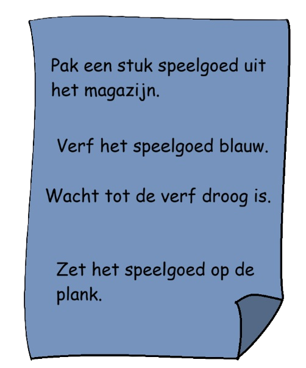
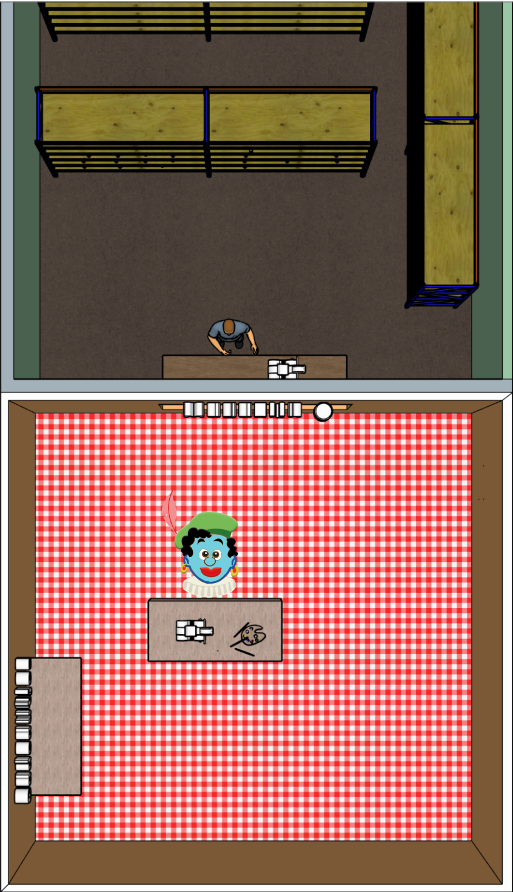
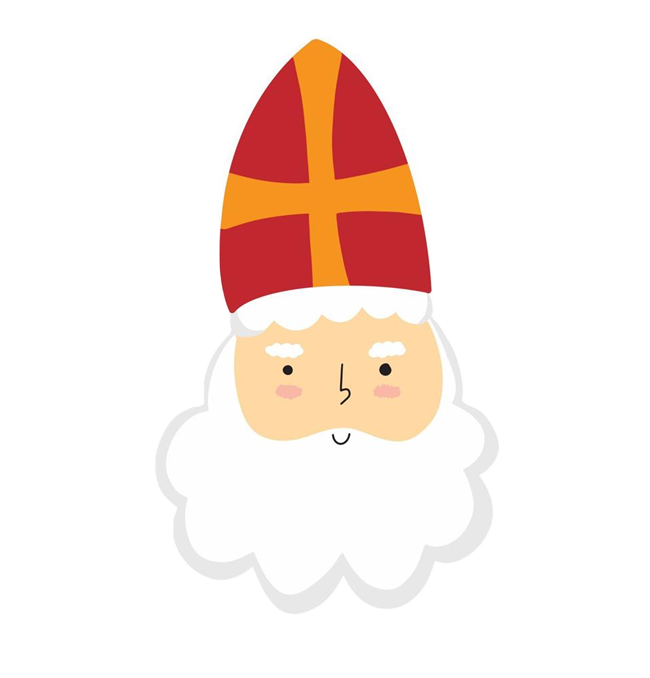
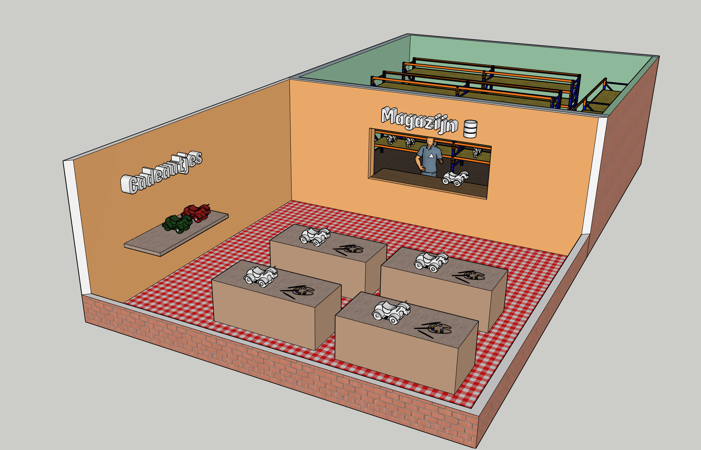
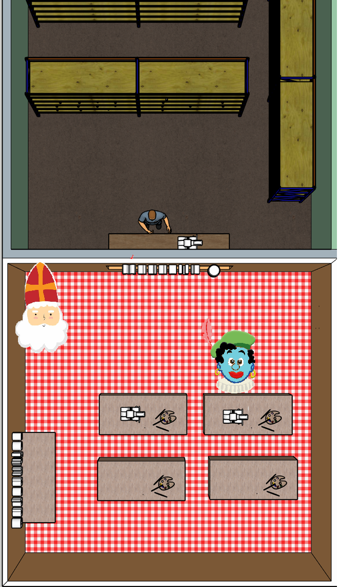
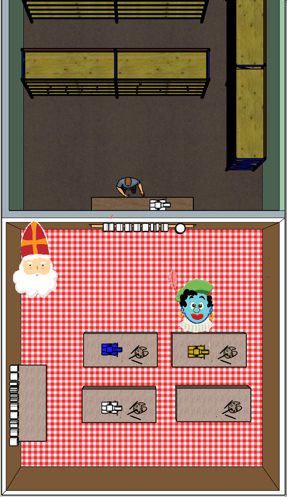
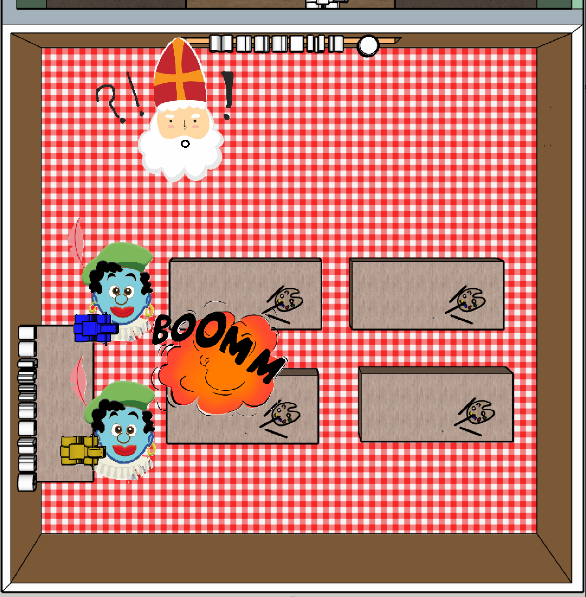
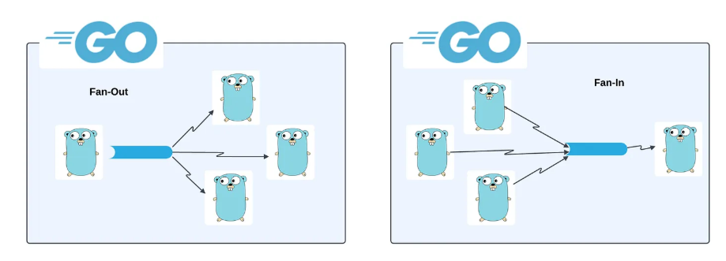

# Concurrency in Go

> Do not communicate by sharing memory; share memory by communicating

---

# Let's start with an example

---

# The gift workshop of Sinterklaas

<style scoped>
img { display: block; margin: 0 auto; }
</style>


---

# Painting toys

<div style="display: flex; gap: 20px; align-items: center;">
<div style="flex: 1;">



</div>
<div style="flex: 1;">


</div>
</div>

---

# The Go implementation

```go
type Toy struct {
    ID int
    Color string
    Dry bool
}
```

```go
func createToy(id int, color string, shelf *[]Toy) {
    toy := FetchToyFromStorage(id)
    PaintToy(&toy, color)
    DryPaint(&toy)
    *shelf = append(*shelf, toy)
}

```

---

# More toys to paint!


---

# More toys to paint!

```go
func main() {
    // create a shelf to store the painted toys
    var shelf []utils.Toy

    // create a slice of colors for the toys (type is infered)
    colors := []string{"blue", "yellow", "green"}
	
    // paint the toys
    for i, color := range colors {
        createToy(i+1, color, &shelf)
    }
}
```

---


<style scoped>
img { display: block; margin: 0 auto; }
</style>


---

<style scoped>
img { display: block; margin: 0 auto; }
</style>



---

<style scoped>
img { display: block; margin: 0 auto; }
</style>


---

<style scoped>
img { display: block; margin: 0 auto; }
</style>


---

> *"This is too slow! We need to finish before Pakjesavond!"*

<style scoped>
img { display: block; margin: 0 auto; }
</style>



---

# More desks!

<style scoped>
img { display: block; margin: 0 auto; }
</style>



---

<style scoped>
img { display: block; margin: 0 auto; }
</style>


---

<style scoped>
img { display: block; margin: 0 auto; }
</style>


---

<style scoped>
img { display: block; margin: 0 auto; }
</style>



---

<style scoped>
img { display: block; margin: 0 auto; }
</style>


---


<style scoped>
img { display: block; margin: 0 auto; }
</style>


---

<style scoped>
img { display: block; margin: 0 auto; }
</style>



---


<style scoped>
img { display: block; margin: 0 auto; }
</style>


---


---

* A goroutine is a lightweight thread of execution managed by the Go runtime. 
* Goroutines run in the same address space, so access to shared memory must be synchronized.

---

Sync

```go

func main(){
    for i,color := range colors {
        createToy(i+1, color, &shelf)
    }
}
```

Concurrent

```go
func main(){
    for i,color := range colors {
        go createToy(i+1, color, &shelf)
    }
}

```

---

* One problem, the main function will finish before all the work is done.
* Solution: Wait groups

---

```go
func main(){
    var toysDone sync.WaitGroup

    for i, color := range colors {
        toysDone.Add(1)
        go createToy(i+1, color, &shelf, &toysDone)
    }

    // wait for all the toys to be made
    toysDone.Wait()
}
```

```go
func createToy(id int, color string, shelf *[]utils.Toy, wg *sync.WaitGroup) {
    defer wg.Done()	// Lower the waitgroup counter by one
    toy := utils.FetchToyFromStorage(id)
    utils.PaintToy(&toy, color)
    utils.DryPaint(&toy)
    *shelf = append(*shelf, toy)
}

```
---

# New problem


<style scoped>
img { display: block; margin: 0 auto; }
</style>



---

# Mutex

<style scoped>
img { display: block; margin: 0 auto; }
</style>


---

# Mutex

```go
var mu sync.Mutex

func someFunction(mu *sync.Mutex){
    mu.Lock()
    *shelf = append(*shelf, toy)
    mu.Unlock()
}
```

---

# Channels


<style scoped>
img { display: block; margin: 0 auto; }
</style>


---

# Syntax

```go
// Creating a channel (unbuffered)
ch := make(chan string)

// Sending data (like placing an order through the service window)
ch <- "Steak, medium rare"

// Receiving data (like picking up an order from the service window)
message := <-ch
```

---

# Unbuffered channels

* Unbuffered channels will block a goroutine trying to write to it if it already contains data.
* Can be used for synchronization and real-time transfer

---

# Buffered channels

* Buffered channels work like a queue
* Will only block writers if it is full
* Provide some flexibility
* Enable asynchronous transfer

---

# Syntax

```go
ch := make(chan int, 2)
ch <- 1
ch <- 2
fmt.Println(<-ch)
fmt.Println(<-ch)
```

---

# Some patterns


<style scoped>
img { display: block; margin: 0 auto; }
</style>


