<!-- _class: lead -->
<!-- _paginate: false -->

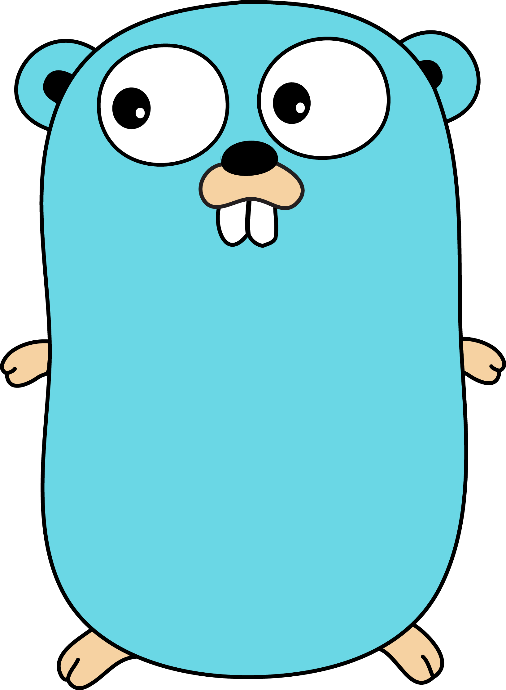

# Pythoneersdag GO


---

## Waarom bestaat Go?

- 2007, Google: C++ compileerde te traag, Java was te log, en Python
  schaalde niet goed genoeg voor hun grootste systemen (denk: de GIL)
- Gemaakt door Robert Griesemer, Rob Pike en Ken Thompson - ja, dezelfde
  Ken Thompson die mee aan de wieg van Unix stond
- 2009 open source, 2012 versie 1.0 met een backwards-compatibility-
  belofte die nu nog steeds geldt

---

## Wat is Go, kort - versus wat jullie kennen

| | Python | Go |
|---|---|---|
| Uitvoering | Interpreted | Compiled naar machinecode |
| Typing | Dynamisch | Statisch |
| Geheugen | Garbage collected | Garbage collected |
| Concurrency | GIL / asyncio | Ingebouwd met goroutines
| Deployment | Runtime + dependencies nodig | Eén binary |

<!--
Dit is het spoorboekje voor de rest van de talk. Herkenbaar: beide zijn
garbage collected, dus geen handmatig geheugenbeheer zoals in C. Het
belangrijkste verschil dat we vandaag steeds gaan terugzien: Python
controleert pas tijdens het draaien, Go al bij het compileren.
-->

---

## Typing: dynamisch versus statisch

```python
# Python: crasht pas als regel 3 daadwerkelijk wordt uitgevoerd
def bereken(a, b):
    return a + b

bereken("3", 4)  # TypeError, maar pas tijdens runtime
```

```go
// Go: dit compileert al niet
func bereken(a, b int) int {
    return a + b
}
```

---
<!-- _class: two-columns -->

## Basistypen in Go

<div>

| Type | Voorbeeld | Python |
|---|---|---|
| `int` | `42` | `int` |
| `float64` | `3.14` | `float` |
| `string` | `"Hallo"` | `str` |
| `bool` | `true` | `bool` |
| `rune` | `'A'` | — |
| `byte` | `104` | `byte` |

</div>

<div>

- `int / int` geeft een `int` terug  
  `5 / 2 == 2`

- Geen impliciete conversie:  
  `int` + `float64` → expliciet casten ```2.0 + float64(2)```

- `bool` is strikt:  
  `0`/`1` zijn geen `false`/`true`

</div>


---

## Hello, World

```python
# python
print("Hallo, Pythoneers!")
```

```go
// go
package main

import "fmt"

func main() {
    fmt.Println("Hallo, Pythoneers!")
}
```

Startpunt is altijd `func main()`.

---

## Packages: anders dan Python-modules

- Een package in Go is een **map / folder**, niet een los bestand. 
- Alle `.go`-bestanden in diezelfde map delen automatisch een namespace, geen imports nodig
tussen bestanden in dezelfde map

```go
package main       // regel 1 van élk .go-bestand

import "fmt"        // een hele package, geen "from fmt import Println"
fmt.Println(...)     // altijd via de package-naam ervoor
```

Zichtbaarheid werkt via de hoofdletter: `Bezorg` is geëxporteerd, `bezorg`
is privé. 

---

## Variabelen en zero values

```go
var naam string
naam = "Pythoneers"

var naam string = "Pythoneers"
var naam = "Pythoneers"

naam := "Pythoneers"

var i int    // 0
var s string // ""
var b bool   // false
```

De `:=` vorm gebruik je bijna altijd binnen functies. Elke variabele krijgt
automatisch een zinnige startwaarde.

---


## Functies met meerdere return values


```python
# python
def get_user() -> tuple[str, int]:
    return "Jan-Hein", 25

name, age = get_user()
```


```go
// go
func getUser() (string, int) {
    return "Jan-Hein", 25
}

name, age := getUser()
```

---

## Control flow, kort

```go
if leeftijd >= 18 {
    fmt.Println("volwassen")
}

for i := 0; i < 5; i++ { 
    fmt.Println(i) 
}

for _, cadeau := range cadeaus { 
    fmt.Println(cadeau) 
}

for i < 5 {
    if i == 3 {
        break
    }
    fmt.Println(i) 
    i++
}

```

---

## Structs: geen classes

```python
# python
from dataclasses import dataclass

@dataclass
class Person:
    name: str
    age: int

p = Person("Jan-Hein", 25)
print(p.name) # Jan-Hein
```

```go
// go
type Person struct {
    name   string
    age string
}

p := Person{name: "Jan-Hein", age: 25}
fmt.Println(p.name) // Jan-Hein
```

---

## Methods: behaviour toevoegen. Self?

```go
type Person struct {
    Name string
    Age  int
}

// (p Person) is de "Receiver"
func (p Person) Speak() {
    fmt.Printf("Hoi, ik ben %s\n", p.Name)
}

func main() {
    piet := Person{Name: "Piet", Age: 30}
    piet.Speak() // Output: Hoi, ik ben Piet
}
```
---
## Go valkuil: Waar is mijn data?

Wat gebeurt er als we de data willen aanpassen?
#### python:

```python
class Person:
    def __init__(self, name, age):
        self.name = name
        self.age = age

    def celebrate_birthday(self):
        self.age += 1  # Wijzigt het origineel

person = Person("Jan", 25)
print(person.age)  # 25
person.celebrate_birthday()
print(person.age)  # 26
```

---
## Go valkuil: Waar is mijn data?

```go
type Person struct {
	Name string
	Age  int
}

func (p Person) CelebrateBirthday() {
	p.Age += 1
}

func main() {
	person := Person{
		Name: "Jan",
		Age:  25,
	}

	fmt.Println(person.Age) // 25
	person.CelebrateBirthday()
	fmt.Println(person.Age) // 25, hoe kan dat?
}
```

---


## Pointers
```go
x := 42

xPointer := &x // adres van x, bijv. 0xc0000120c0

*xPointer = 100 // verander x via pointer
fmt.Println(x)  // 100

fmt.Println(xPointer)  // 0xc0000120c0
fmt.Println(*xPointer) // 42
```

### pointer type expliciet
```go
var xPointer *int = &x

```

---
## Methods deel 2, self!

<!-- _class: two-columns -->

<div>

```go
type Person struct {
	Name string
	Age  int
}

func (p Person) CelebrateBirthday() {
	p.Age += 1
}

func main() {
	person := Person{
		Name: "Jan",
		Age:  25,
	}

	fmt.Println(person.Age) // 25
	person.CelebrateBirthday()
	fmt.Println(person.Age) // 25 :(
}
```

</div>

<div>

```go
type Person struct {
	Name string
	Age  int
}

func (p *Person) CelebrateBirthday() {
	p.Age += 1
}

func main() {
	person := Person{
		Name: "Jan",
		Age:  25,
	}

	fmt.Println(person.Age) // 25
	person.CelebrateBirthday()
	fmt.Println(person.Age) // 26 !
}
```

</div>

---
# Array vs Slice

In Python is een `list` altijd dynamisch. In Go splitsen we dit op.

- **Array**: Vaste grootte, kan niet groeien. (Gebruik je zelden).
- **Slice**: Dynamisch venster op een array. (Gebruik je haast altijd).

```go
// ARRAY (vaste lengte)
primesArray := [3]int{2, 3, 5} 

// SLICE (dynamisch)
primesSlice := []int{2, 3, 5} 
```

---

## Data Toevoegen met `append()`

In Python pas je een lijst aan (in-place). In Go *moet* je het resultaat van `append()` altijd opnieuw toewijzen.

```python
# Python
numbers = [1, 2]
numbers.append(3)
```

```go
// Go
numbers := []int{1, 2}

// append geeft een nieuwe slice-structuur terug
numbers = append(numbers, 3) 
```
---

## Valkuil: Slicing Kopieert Niet!

- In Python maakt `a[1:3]` een **nieuwe list** (kopie).
- In Go maakt `a[1:3]` een **nieuw venster** op *hetzelfde* geheugen.

```python
# Python
a = [1, 2, 3]
b = a[1:3]
b[0] = 99   # a blijft [1, 2, 3]
```

```go
// Go
a := []int{1, 2, 3}
b := a[1:3]
b[0] = 99   

fmt.Println(a) // [1, 99, 3] !
```

---

## Kopieren met Copy en Clone

Als je het Python-gedrag wilt (een onafhankelijke kopie), moet je in Go expliciet kopieren

```go
a := []int{1, 2, 3}

// 1. Maak een lege slice met exact dezelfde lengte
b := make([]int, len(a))

// 2. Kopieer de data van a naar b
copy(b, a)

b[0] = 99 // a blijft nu veilig [1, 2, 3]
```
```go
// modern alternatief
import "slices"

a := []int{1, 2, 3}
b := slices.Clone(a)
```


---

## Interfaces: structural typing


<!-- _class: two-columns -->

<div>

```python
# python
from typing import Protocol

class Speaker(Protocol):
    def speak(self) -> str: ...

class Dog:
    def speak(self) -> str:
        return "Woef!"

def make_it_speak(animal: Speaker):
    print(animal.speak())
```

</div>

<div>

```go
// go
type Speaker interface {
    Speak() string
}

type Dog struct{}

func (d Dog) Speak() string {
    return "Woef!"
}

func MakeItSpeak(s Speaker) {
    fmt.Println(s.Speak())
}
```

</div>

---
```go
type Renamer interface {
	ChangeName(newName string)
}

type User struct {
	Name string
}

func (u *User) ChangeName(newName string) {
	u.Name = newName
}

func UpdateUser(r Renamer) {
	r.ChangeName("Bob")
}

func main() {
	u := User{Name: "Alice"}

	// UpdateUser(u)  <-- FOUT: Compilet niet
	
	UpdateUser(&u) // // GOED: We geven het geheugenadres mee via de &pointer

	fmt.Println(u.Name) // Output: Bob
}
```
---

## Error handling: geen exceptions

```python
# python
try:
    resultaat = riskante_actie()
except ValueError as e:
    print(e)
```

```go
// go
resultaat, err := riskanteActie()
if err != nil {
    fmt.Println(err)
    return
}
```

<!--
De grootste filosofische omschakeling van vandaag. Go heeft geen
exceptions, geen try/except. Een functie die kan falen geeft een extra
error-waarde terug als laatste return value, en jij bent verantwoordelijk
om die te checken. Doe je dat niet, dan verdwijnt de fout stilletjes in
het niets - geen vangnet zoals een onafgehandelde exception die met een
duidelijke stack trace crasht. Onderwerp van een van de oefeningen
vanmiddag.
-->

---

## Tooling: alles zit er al in

```bash
go run main.go     # compileer en draai in één stap
go test ./...        # draai alle tests
go fmt ./...            # formatteer je code
go vet ./...              # zoek veelgemaakte foutpatronen
```

Geen Black, geen Flake8, geen losse testrunner nodig - zit standaard in de
go-CLI, en iedereen gebruikt dezelfde tools.

---

## Hoe werkt deel 1?

1. Clone de repo, ga naar `deel1-basis/` Elke oefening daarin staat in zijn eigen mapje.
2. Elke oefening heeft tests die nu falen
3. Los de bug op in de code, niet de tests, tot alles slaagt: `go test ./...`
4. Oefeningen zijn genummerd op moeilijkheid, van makkelijk naar moeilijker

```bash
git clone <repo-url>
cd 2026-08-21-pythoneersdag-go

cd deel1-basis
go test ./...  # test alle oefeningen
# of
cd oefening...
go test  # test de go file in de huidige map
```

---
# Concurrency in Go

> Do not communicate by sharing memory; share memory by communicating

---

# Let's start with an example

---

# The gift workshop of Sinterklaas

<style scoped>
img { display: block; margin: 0 auto; }
</style>

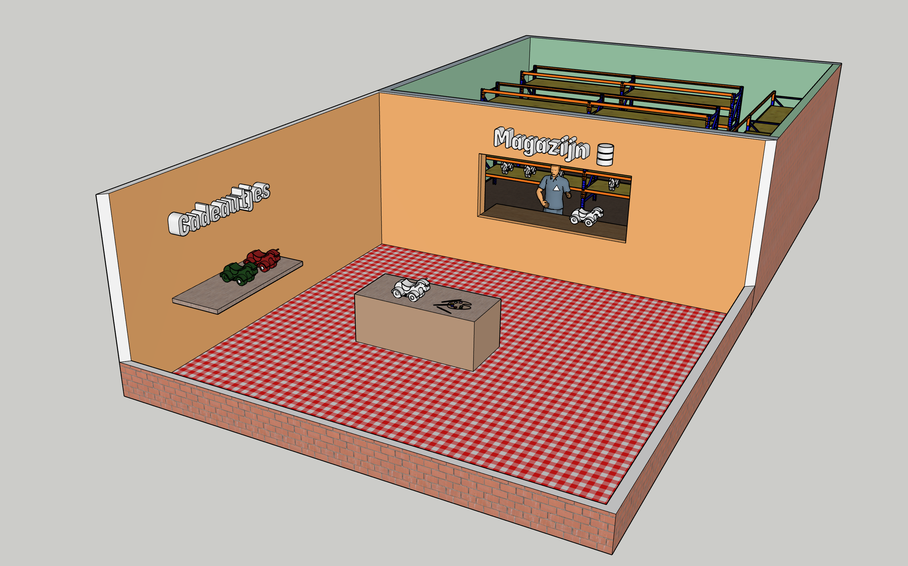

---

<!-- _class: two-columns -->

<div>


</div>
<div>


</div>

---

# The Go implementation

```go
type Toy struct {
    ID int
    Color string
    Dry bool
}
```

```go
func createToy(id int, color string, shelf *[]Toy) {
    toy := FetchToyFromStorage(id)
    PaintToy(&toy, color)
    DryPaint(&toy)
    *shelf = append(*shelf, toy)
}

```

---

# More toys to paint!

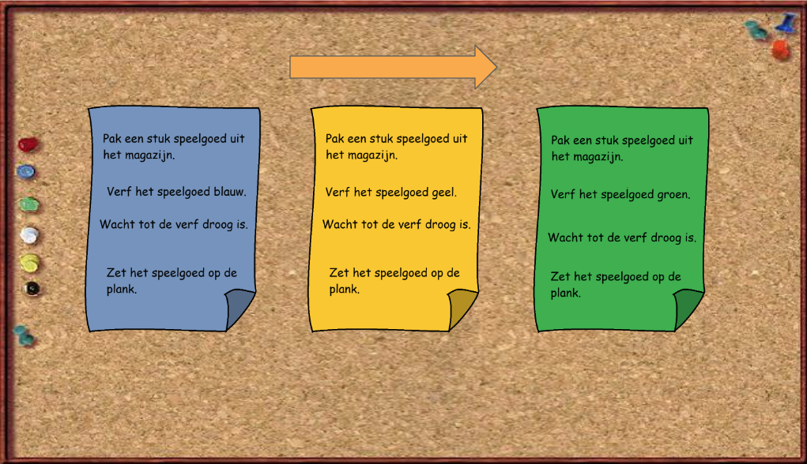

---

# More toys to paint!

```go
func main() {
    // create a shelf to store the painted toys
    var shelf []utils.Toy

    // create a slice of colors for the toys (type is infered)
    colors := []string{"blue", "yellow", "green"}
	
    // paint the toys
    for i, color := range colors {
        createToy(i+1, color, &shelf)
    }
}
```

---


<style scoped>
img { display: block; margin: 0 auto; }
</style>

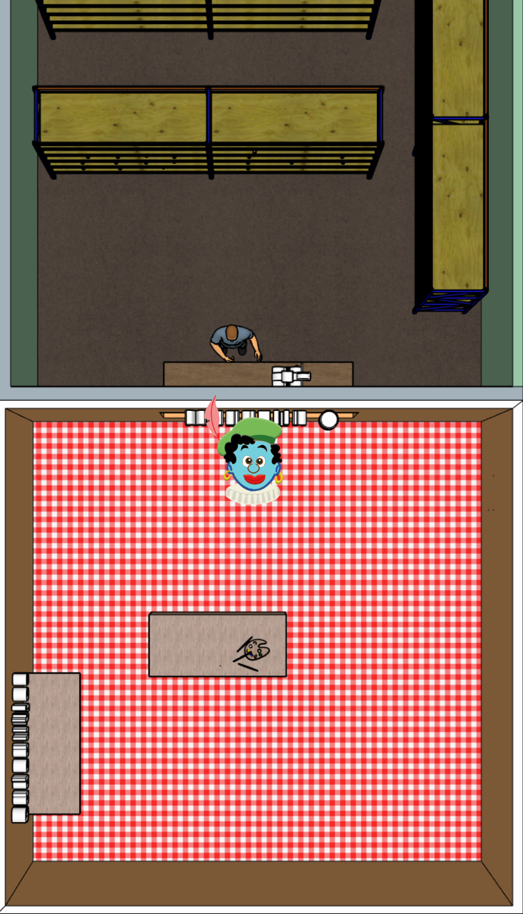

---

<style scoped>
img { display: block; margin: 0 auto; }
</style>


---

<style scoped>
img { display: block; margin: 0 auto; }
</style>


---

<style scoped>
img { display: block; margin: 0 auto; }
</style>

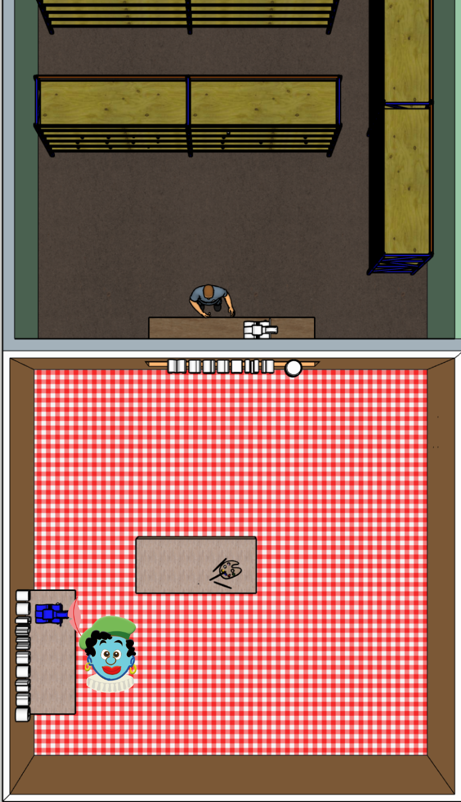

---

> *"This is too slow! We need to finish before Pakjesavond!"*

<style scoped>
img { display: block; margin: 0 auto; }
</style>


---

# More desks!

<style scoped>
img { display: block; margin: 0 auto; }
</style>


---

<style scoped>
img { display: block; margin: 0 auto; }
</style>

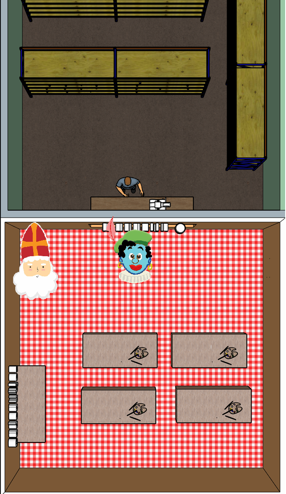

---

<style scoped>
img { display: block; margin: 0 auto; }
</style>

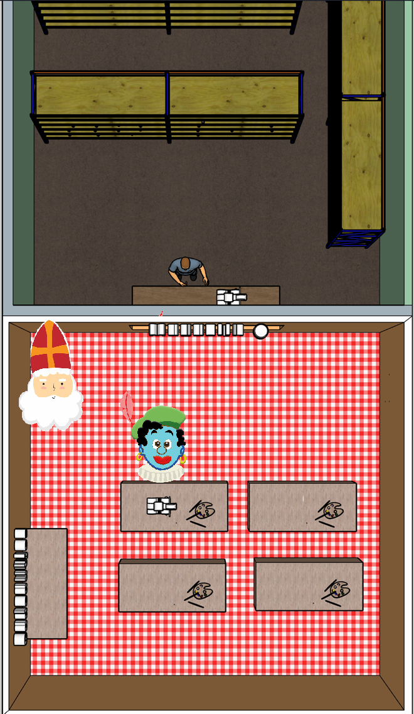

---

<style scoped>
img { display: block; margin: 0 auto; }
</style>


---

<style scoped>
img { display: block; margin: 0 auto; }
</style>

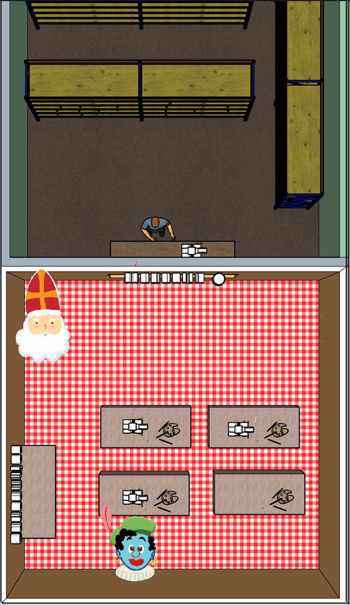

---


<style scoped>
img { display: block; margin: 0 auto; }
</style>

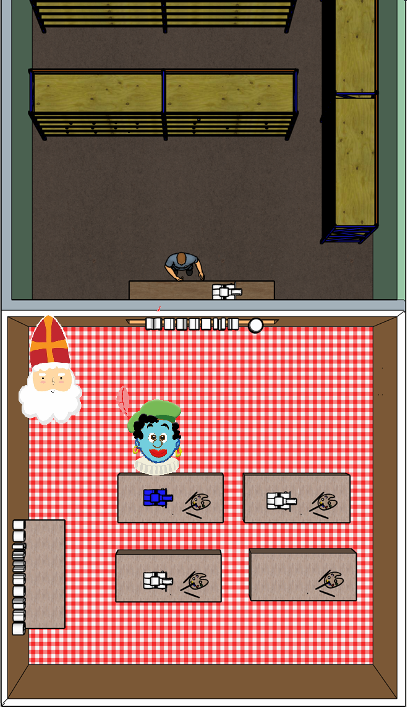

---

<style scoped>
img { display: block; margin: 0 auto; }
</style>


---


<style scoped>
img { display: block; margin: 0 auto; }
</style>

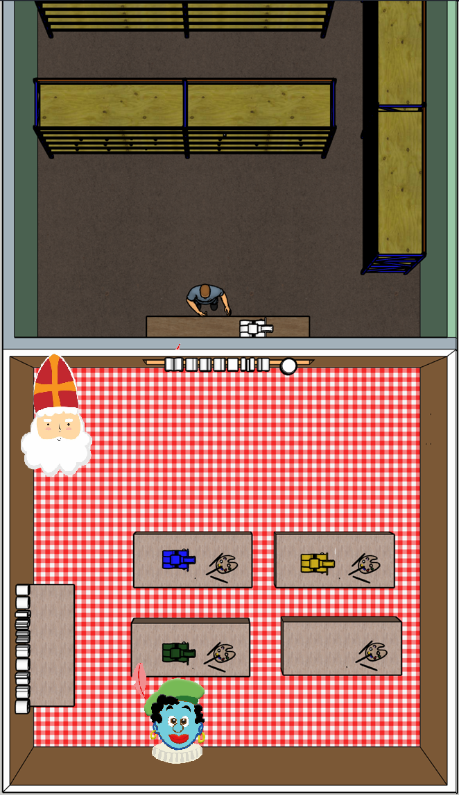

---

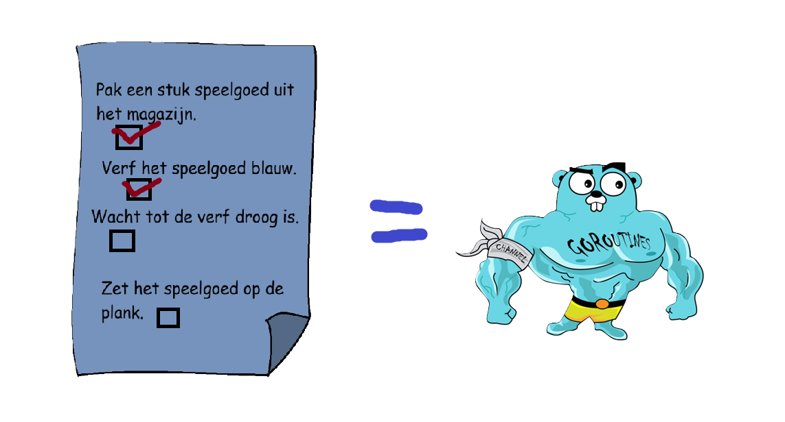


---

* A goroutine is a lightweight thread of execution managed by the Go runtime. 
* Goroutines run in the same address space, so access to shared memory must be synchronized.

---

Sync

```go

func main(){
    for i,color := range colors {
        createToy(i+1, color, &shelf)
    }
}
```

Concurrent

```go
func main(){
    for i,color := range colors {
        go createToy(i+1, color, &shelf)
    }
}

```

---

* One problem, the main function will finish before all the work is done.
* Solution: Wait groups

---

```go
func main(){
    var toysDone sync.WaitGroup

    for i, color := range colors {
        toysDone.Add(1)
        go createToy(i+1, color, &shelf, &toysDone)
    }

    // wait for all the toys to be made
    toysDone.Wait()
}
```

```go
func createToy(id int, color string, shelf *[]utils.Toy, wg *sync.WaitGroup) {
    defer wg.Done()	// Lower the waitgroup counter by one
    toy := utils.FetchToyFromStorage(id)
    utils.PaintToy(&toy, color)
    utils.DryPaint(&toy)
    *shelf = append(*shelf, toy)
}

```
---

# New problem


<style scoped>
img { display: block; margin: 0 auto; }
</style>


---

# Mutex

<style scoped>
img { display: block; margin: 0 auto; }
</style>


---

# Mutex

```go
var mu sync.Mutex

func someFunction(mu *sync.Mutex){
    mu.Lock()
    *shelf = append(*shelf, toy)
    mu.Unlock()
}
```

---

# Channels


<style scoped>
img { display: block; margin: 0 auto; }
</style>

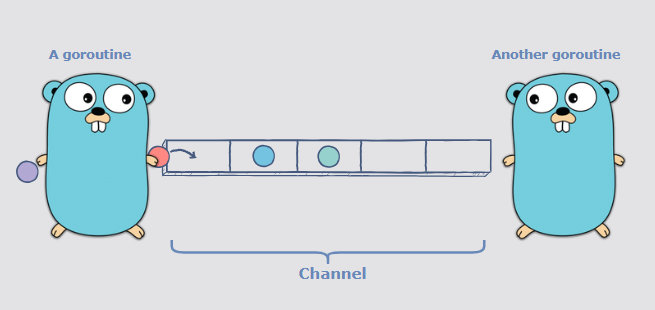

---

# Syntax

```go
// Creating a channel (unbuffered)
ch := make(chan string)

// Sending data (like placing an order through the service window)
ch <- "Steak, medium rare"

// Receiving data (like picking up an order from the service window)
message := <-ch
```

---

# Unbuffered channels

* Unbuffered channels will block a goroutine trying to write to it if it already contains data.
* Can be used for synchronization and real-time transfer

---

# Buffered channels

* Buffered channels work like a queue
* Will only block writers if it is full
* Provide some flexibility
* Enable asynchronous transfer

---

# Syntax

```go
ch := make(chan int, 2)
ch <- 1
ch <- 2
fmt.Println(<-ch)
fmt.Println(<-ch)
```

---

# Some patterns


<style scoped>
img { display: block; margin: 0 auto; }
</style>


---

 
 
<!-- _class: lead -->
<!-- _paginate: false -->
 
 
# Laatste opdracht

---

