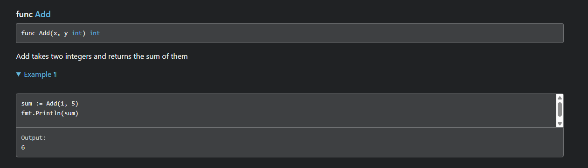

---

# Testing in Go

* Built into the standard library
* Tests live in there own files close to production code
* Test code is not included in the binary

---

## One command for

- unit tests
- benchmarks
- examples
- coverage analysis
- race detection


<!-- pause -->

```bash
    go test {-cover}
```

---

## Go test

<!--
Weet niet of deze slide nodig is.
-->

Running `go test` will

1. Compile your normal package code
2. Compiles your _test.go files
3. Create a temporary test executable
4. Runs that executable
5. Discard the executable

---


## Go intentionally has no assert keyword 


> *"Tests are programs. Use normal language constructs."*

---

## How to write tests

Test files end in _test.go and live in the same directory as the code they test.

```text
 myapp/
  │ ├── integers/
  │ │   ├── addition.go
  │ │   └── addition_test.go
  │ ├── main.go
  │ └── go.mod
```

---

## How to write tests

The function we want to test:

```go
// addition.go

package integers

// Add takes two integers and returns the sum of them
func Add(x, y int) int {
	return x + y
}

```

---

## How to write tests

```go
// addition_test.go

package integers

import (
	"testing"
	"fmt"
)

func TestAdder(t *testing.T) {
	sum := Add(2, 2)
	expected := 4

	if sum != expected {
		t.Errorf("got %d, want %d", sum, expected)
	}
}
```

---

## How to write tests

```go
// addition_test.go

package integers

import (
	"testing"
	"fmt"
)

func TestAdder(t *testing.T) {
	sum := Add(2, 2)
	expected := 4

	if sum != expected {
		t.Errorf("got %d, want %d", sum, expected)
	}
}

func ExampleAdd() {
	sum := Add(1, 5)
	fmt.Println(sum)
	// Output: 6
}

```

---

```text
❯ go test -v
=== RUN   TestAdder
--- PASS: TestAdder (0.00s)
=== RUN   ExampleAdd
--- PASS: ExampleAdd (0.00s)
PASS

```

---


```bash
go install golang.org/x/pkgsite/cmd/pkgsite@latest
pkgsite -open .
```


