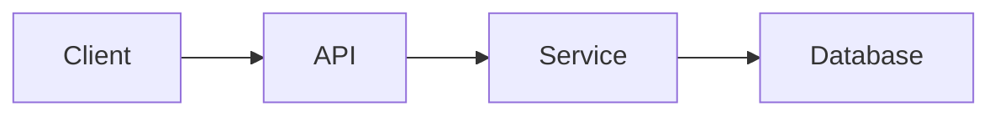

# Agenda

* Why Go?
* Language basics
* Concurrency
* Project structure
* Tooling
* Summary

---

<!--
Voorbeeld presentatie
-->

# Why Go?

- Fast compilation
- Excellent standard library
- Simple deployment
- Strong ecosystem
- Built-in concurrency support

---

# Go in Numbers

| Metric | Value |
|----------|----------|
| Initial release | 2009 |
| Current use cases | Cloud, APIs, DevOps |
| Binary output | Single executable |
| Concurrency model | Goroutines |

---

# Hello World

```go {1-8}
package main

import "fmt"

func main() {
    fmt.Println("Hello, World!")
}
```

### Observations

* Minimal syntax
* Fast compile cycle
* Statically typed

---

# Two Column Layout

<div class="columns">
<div>

## Advantages

* Simple
* Readable
* Performant
* Strong tooling

</div>

<div>

## Common Uses

* APIs
* CLIs
* Kubernetes operators
* Backend services

</div>
</div>

<style scoped>
.columns {
  display: grid;
  grid-template-columns: 1fr 1fr;
  gap: 2rem;
}
</style>

---

# Struct Example

```go
type User struct {
    Name string
    Email string
    Active bool
}

func (u User) DisplayName() string {
    return u.Name
}
```

* Structs hold data
* Methods add behavior
* No inheritance hierarchy required

---


# Concurrency

> "Do not communicate by sharing memory; instead, share memory by communicating."

---

# Goroutines

```go
package main

import (
    "fmt"
    "time"
)

func worker(id int) {
    fmt.Printf("worker %d\n", id)
}

func main() {
    go worker(1)
    go worker(2)

    time.Sleep(time.Second)
}
```

* Lightweight
* Cheap to create
* Managed by Go runtime

---

# Channels

```go
func main() {
    ch := make(chan string)

    go func() {
        ch <- "hello"
    }()

    msg := <-ch
    fmt.Println(msg)
}
```

### Flow

1. Create channel
2. Send value
3. Receive value
4. Continue execution

---

# Project Structure

```text
myapp/
├── cmd/
│   └── api/
├── internal/
│   ├── service/
│   └── repository/
├── pkg/
├── configs/
└── go.mod
```

* Clear separation of concerns
* Easy scaling
* Common community convention

---

# Tooling

| Tool | Purpose |
|--------|--------|
| go fmt | Formatting |
| go test | Testing |
| go vet | Static analysis |
| golangci-lint | Linting |
| air | Live reload |

---

# Example Test

```go
func TestAdd(t *testing.T) {
    got := Add(2, 3)

    if got != 5 {
        t.Fatalf("expected 5, got %d", got)
    }
}
```

Benefits:

* Confidence
* Documentation
* Refactoring safety

---

# Architecture Overview



> Marp can render Mermaid diagrams when supported by your setup.

---

# Full Image Background


# Go + Cloud Native

* Containers
* Kubernetes
* Microservices
* Observability

---

<!-- _backgroundColor: #1e293b -->
<!-- _color: white -->

# Deployment

```bash
go build -o myapp

docker build -t myapp .

docker run myapp
```

* Single static binary
* Easy containerization
* Fast startup

---

# Key Takeaways

* Go is simple
* Go is fast
* Concurrency is a first-class feature

<!-- pause -->

* Tooling is excellent

<!-- pause -->

* Operational complexity stays low

---

<!-- _class: lead -->

# Questions?

Thank you 🚀

### github.com/example/project
